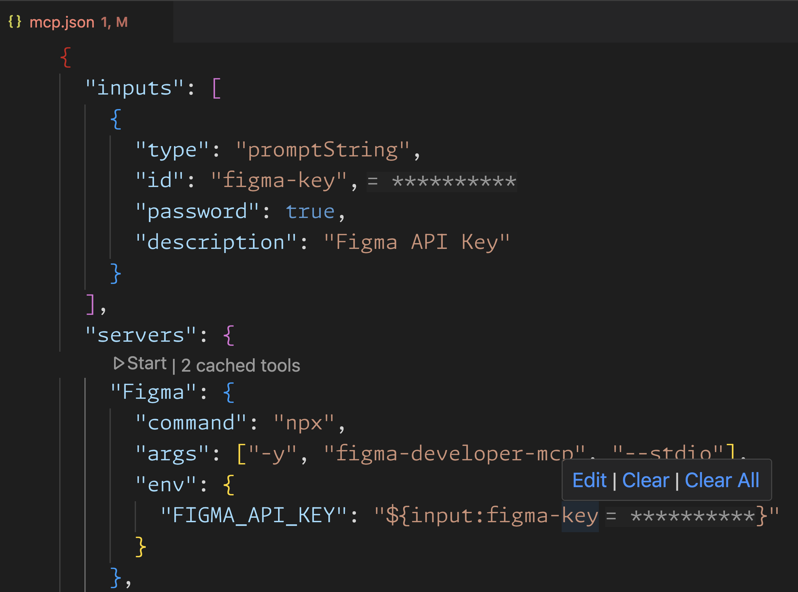

# About
The VS Code team has been focused on MCP support for GitHub Copilot in their March 2023 iteration. 

You can follow the [MCP implementation progress based in their repo microsoft/vscode](https://github.com/microsoft/vscode/labels/chat-mcp)

As of 28.03. the nightly build of[ VS Code Insiders](https://code.visualstudio.com/insiders/) contains MCP support. Expect it to be release in preview state to VS Code in early April.

## Usage
MCP support is initially only be available from [GitHub Copilot agent mode](https://code.visualstudio.com/blogs/2025/02/24/introducing-copilot-agent-mode). This functionality is in preview state.

## Setup
Setup is done through the command (CTRL+SHIFT+P) MCP: Add server...

Here you can add servers based on:
- NPM package
- Pip package
- Docker image
- Command (stdio) - Run a local command that implements the MCP protocol
- HTTP (server-sent events) Connect to a remote HTTP server that implements the MCP protocol

The settings are stored in a mcp.json configuration file and is very similar to the format used by Claude. It has an option to import automatically if you have set it up MCP servers in other IDEs

You can also configure the MCP servers in mcp.json directly. This supports secrets and .env references (`${localEnv:ENV_VARIABLE1}`)

## Security 
We've made a feature request [MCP: version pin packages when added via npm/docker/pip](https://github.com/microsoft/vscode/issues/244556) which is a candidate for the April iteration